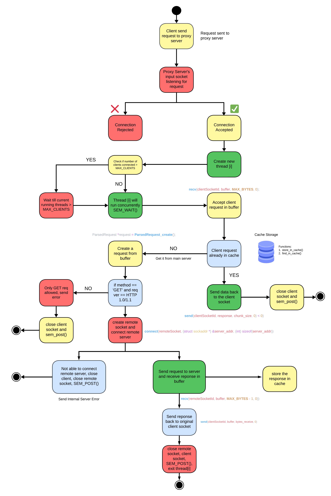

# Multi-Threaded Proxy Server with LRU Cache


## Overview

This project implements a multi-threaded proxy server using the Least Recently Used (LRU) cache algorithm in C. The proxy server forwards client requests to remote servers, caches responses, and serves repeated requests from the cache to reduce latency. The cache is managed using an LRU strategy, ensuring efficient memory usage by evicting the least recently accessed entries when the cache reaches its capacity.

## Features

- **Multi-Threaded Architecture**: The server can handle multiple client requests concurrently, each handled by a separate thread.
- **LRU Cache**: Uses a combination of a doubly linked list and a hash map to store and manage cache entries efficiently.
- **Semaphore-based Synchronization**: Ensures safe access to shared resources across threads without race conditions.
- **Error Handling**: Supports proper error reporting for invalid requests and failed connections.
- **Supports Only GET Requests**: The server is designed to handle only HTTP GET requests in version 1.0/1.1.

## Flow Diagram

The flow of the proxy server operation is illustrated in the following diagram:



### Process Flow:
1. **Client Request**: A client sends a request to the proxy server.
2. **Connection Handling**: The proxy server listens for incoming requests and accepts valid connections while rejecting others if the number of concurrent threads exceeds the maximum limit.
3. **Request Processing**: The request is parsed and checked to see if it is available in the cache.
4. **LRU Cache Check**:
    - If the requested resource is in the cache, it is sent directly to the client.
    - If not, the server retrieves it from the main server, forwards it to the client, and stores the response in the cache.
5. **Thread Management**: Each request is handled by a new thread, and semaphore synchronization is used to control thread access to shared resources.

## Key Components

### 1. `proxy_parse.c` & `proxy_parse.h`
Handles parsing and validating HTTP requests from clients.

- **Functions**:
  - `ParsedRequest_create()`: Creates a parsed request from the client buffer.
  - Request validation and extraction logic.

### 2. `map.c` & `map.h`
Implements a hash map that helps in caching URL-to-cache element mapping.

- **Functions**:
  - `init_map()`: Initializes the hash map.
  - `find()`: Finds a cached entry based on the URL.
  - `insert()`: Inserts a new entry into the hash map.
  - `erase()`: Removes an entry when the cache limit is reached.

### 3. `lru_cache.c` & `lru_cache.h`
Implements the core LRU caching mechanism with a doubly linked list.

- **Functions**:
  - `init_cache()`: Initializes the LRU cache.
  - `find_in_cache()`: Retrieves a cached item if present and relocates it to the head of the list.
  - `store_in_cache()`: Adds a new item to the cache or updates an existing one.
  - `delete_from_tail()`: Removes the least recently used item when the cache is full.
  - `insert_at_head()`: Adds the element to the cache and makes it new head.

### 4. `main.c`
The entry point of the server, responsible for accepting client connections and delegating work to threads.

- **Functions**:
  - `handle_request()`: Manages the client request, checks the cache, and forwards the request to the remote server if necessary.
  - `thread_rn()`: Thread handler function for managing multiple client requests concurrently.

## Limitations

- **HTTP Methods**: The proxy server currently supports only `GET` requests.
- **Cache Size**: The size of the cache is fixed and can be configured in the source code.
- **Error Handling**: Limited to basic HTTP 1.0/1.1 errors.

## Future Enhancements

- Add support for additional HTTP methods like `POST`, `PUT`, etc.
- Implement persistent caching to store data across server restarts.
- Add HTTPS support using SSL/TLS.  

## Setup & Compilation

1. **Clone the Repository**:
   ```bash
   git clone https://github.com/httpsanuj1807/proxy-server-in-c.git
   cd proxy-server-in-c

2. **Compile the Project**: Use the following command to compile the project
    ```bash
    make

3. **Run the Proxy Server**: Start the proxy server on a specific port:
    ```bash
    ./proxy [port_number_of_your_choice]
4. **Request a website**
    ```bash
    // example port 8080
    http://localhost:8080/https://www.cs.princeton.edu/  

## Contributing

Contributions are welcome! There is a lot of scope for improving this project. If you'd like to contribute to this project, please connect.


## 🌎 Contact

[](https://github.com/httpsanuj1807)
[](https://www.linkedin.com/in/anuj-kumar-7837a9268)
[](https://www.instagram.com/https_anuj1807)